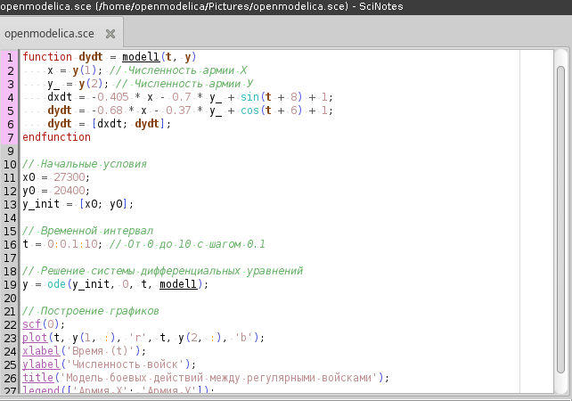
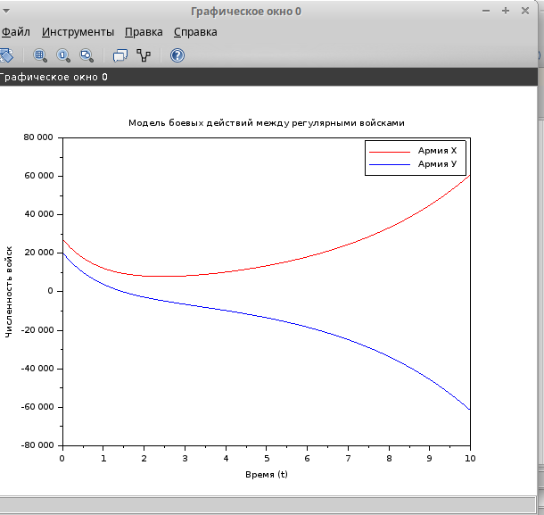
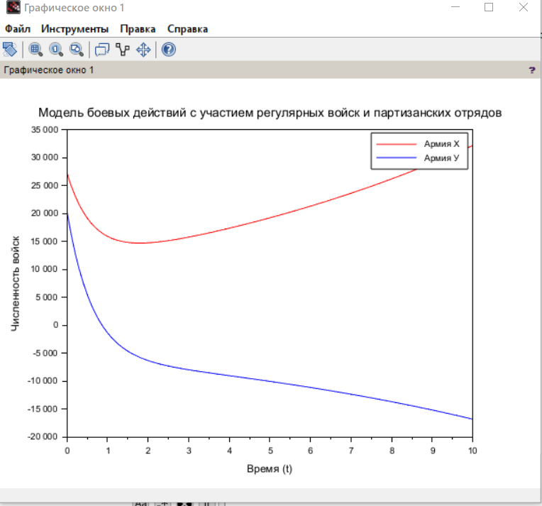

---
## Front matter
lang: ru-RU
title: Лабораторная работа №3
subtitle: Модель боевых действий
author:
  - Джахангиров Илгар Залид оглы
institute:
  - Российский университет дружбы народов, Москва, Россия

## i18n babel
babel-lang: russian
babel-otherlangs: english

## Formatting pdf
toc: false
toc-title: Содержание
slide_level: 2
aspectratio: 169
section-titles: true
theme: metropolis
header-includes:
 - \metroset{progressbar=frametitle,sectionpage=progressbar,numbering=fraction}
 - '\makeatletter'
 - '\beamer@ignorenonframefalse'
 - '\makeatother'
---

# Информация

## Докладчик

:::::::::::::: {.columns align=center}
::: {.column width="70%"}

  * Джахангиров Илгар Залид оглы
  * студент
  * Российский университет дружбы народов
  * [1032225689@pfur.ru]

:::
::::::::::::::

## Цель работы

Построить модель боевых действий на языке прогаммирования Julia и посредством ПО OpenModelica.

## Задание

Между страной $X$ и страной $Y$ идет война. Численность состава войск
исчисляется от начала войны, и являются временными функциями $x(t)$ и $y(t)$. В
начальный момент времени страна $X$ имеет армию численностью 30 000 человек,
а в распоряжении страны $Y$ армия численностью в 17 000 человек. Для упрощения
модели считаем, что коэффициенты $a, b, c, h$ постоянны. Также считаем $P(t)$ и $Q(t)$ непрерывные функции.

Построить графики изменения численности войск армии $X$ и армии $Y$ для  следующих случаев:

1. Модель боевых действий между регулярными войсками
$$\begin{cases}
    \dfrac{dx}{dt} = -0.405x(t)- 0.7y(t)+sin(t+8)+1\\
    \dfrac{dy}{dt} = -0.68x(t)- 0.37y(t)+cos(t+6)+1
\end{cases}$$

2. Модель ведение боевых действий с участием регулярных войск и партизанских отрядов

$$\begin{cases}
    \dfrac{dx}{dt} = -0.304x(t)-0.78y(t)+2sin(2t)\\
    \dfrac{dy}{dt} = -0.68x(t)y(t)-0.2y(t)+2cos(2t)
\end{cases}$$

## Выполнение лабораторной работы

// Определение системы дифференциальных уравнений
function dydt = model1(t, y)
    x = y(1); // Численность армии Х
    y_ = y(2); // Численность армии У
    dxdt = -0.405 * x - 0.7 * y_ + sin(t + 8) + 1;
    dydt = -0.68 * x - 0.37 * y_ + cos(t + 6) + 1;
    dydt = [dxdt; dydt];
endfunction

// Начальные условия
x0 = 27300;
y0 = 20400;
y_init = [x0; y0];

// Временной интервал
t = 0:0.1:10; // От 0 до 10 с шагом 0.1

// Решение системы дифференциальных уравнений
y = ode(y_init, 0, t, model1);

// Построение графиков
scf(0);
plot(t, y(1, :), 'r', t, y(2, :), 'b');
xlabel('Время (t)');
ylabel('Численность войск');
title('Модель боевых действий между регулярными войсками');
legend(['Армия Х'; 'Армия У']);

## Модель боевых действий между регулярными войсками

\begin{cases}
    \dfrac{dx}{dt} = -0.304x(t)-0.78y(t)+2sin(2t)\\
    \dfrac{dy}{dt} = -0.68x(t)y(t)-0.2y(t)+2cos(2t)
\end{cases}$$

## Выполнение лабораторной работы

## Выполнение лабораторной работы

## Выполнение лабораторной работы

// Определение системы дифференциальных уравнений
function dydt = model2(t, y)
    x = y(1); // Численность армии Х
    y_ = y(2); // Численность армии У
    dxdt = -0.304 * x - 0.78 * y_ + 2 * sin(2 * t);
    dydt = -0.68 * x - y_ - 0.2 * y_ + 2 * cos(2 * t);
    dydt = [dxdt; dydt];
endfunction

// Начальные условия
x0 = 27300;
y0 = 20400;
y_init = [x0; y0];

// Временной интервал
t = 0:0.1:10; // От 0 до 10 с шагом 0.1

// Решение системы дифференциальных уравнений
y = ode(y_init, 0, t, model2);

// Построение графиков
scf(1);
plot(t, y(1, :), 'r', t, y(2, :), 'b');
xlabel('Время (t)');
ylabel('Численность войск');
title('Модель боевых действий с участием регулярных войск и партизанских отрядов');
legend(['Армия Х'; 'Армия У']);

## Выполнение лабораторной работы

## Выполнение лабораторной работы

Для начала построим эту модель на Julia:

## Вывод

 В процессе выполнения данной лабораторной работы я построил модель боевых действий на языке прогаммирования Julia и посредством ПО OpenModelica, а также провела сравнительный анализ.