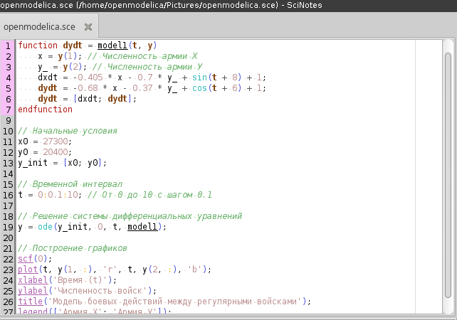
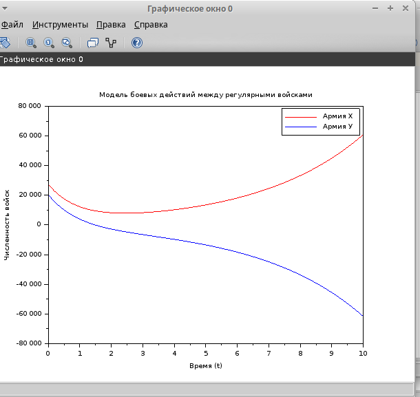
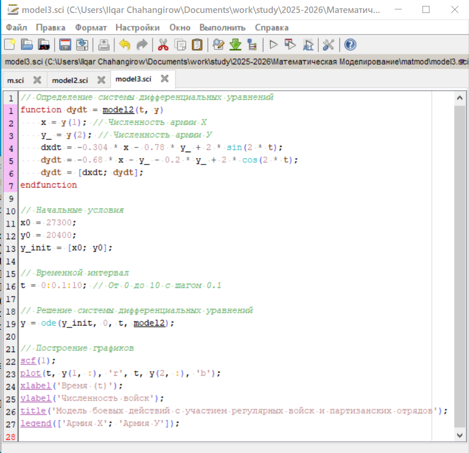
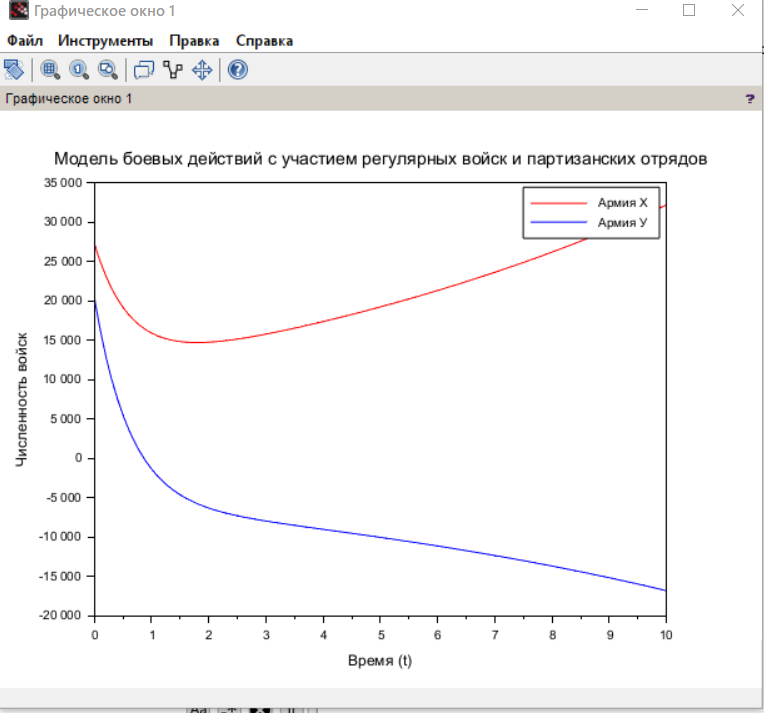

---
## Front matter
title: "Лабораторная работа № 3"
subtitle: "Модель боевых действий"
author: "Джахангиров Илгар Залид оглы"

## Generic otions
lang: ru-RU
toc-title: "Содержание"

## Bibliography
bibliography: bib/cite.bib
csl: pandoc/csl/gost-r-7-0-5-2008-numeric.csl

## Pdf output format
toc: true # Table of contents
toc-depth: 2
lof: true # List of figures
lot: false # List of tables
fontsize: 12pt
linestretch: 1.5
papersize: a4
documentclass: scrreprt
## I18n polyglossia
polyglossia-lang:
  name: russian
  options:
	- spelling=modern
	- babelshorthands=true
polyglossia-otherlangs:
  name: english
## I18n babel
babel-lang: russian
babel-otherlangs: english
## Fonts
mainfont: PT Serif
romanfont: PT Serif
sansfont: PT Sans
monofont: PT Mono
mainfontoptions: Ligatures=TeX
romanfontoptions: Ligatures=TeX
sansfontoptions: Ligatures=TeX,Scale=MatchLowercase
monofontoptions: Scale=MatchLowercase,Scale=0.9
## Biblatex
biblatex: true
biblio-style: "gost-numeric"
biblatexoptions:
  - parentracker=true
  - backend=biber
  - hyperref=auto
  - language=auto
  - autolang=other*
  - citestyle=gost-numeric
## Pandoc-crossref LaTeX customization
figureTitle: "Рис."
tableTitle: "Таблица"
listingTitle: "Листинг"
lofTitle: "Список иллюстраций"
lotTitle: "Список таблиц"
lolTitle: "Листинги"
## Misc options
indent: true
header-includes:
  - \usepackage{indentfirst}
  - \usepackage{float} # keep figures where there are in the text
  - \floatplacement{figure}{H} # keep figures where there are in the text
---

# Цель работы

Построить модель боевых действий на языке прогаммирования Julia и посредством ПО OpenModelica.

# Задание

Между страной $X$ и страной $Y$ идет война. Численность состава войск
исчисляется от начала войны, и являются временными функциями $x(t)$ и $y(t)$. В
начальный момент времени страна $X$ имеет армию численностью 30 000 человек,
а в распоряжении страны $Y$ армия численностью в 17 000 человек. Для упрощения
модели считаем, что коэффициенты $a, b, c, h$ постоянны. Также считаем $P(t)$ и $Q(t)$ непрерывные функции.

Построить графики изменения численности войск армии $X$ и армии $Y$ для  следующих случаев:

1. Модель боевых действий между регулярными войсками
$$\begin{cases}
    \dfrac{dx}{dt} = -0.405x(t)- 0.7y(t)+sin(t+8)+1\\
    \dfrac{dy}{dt} = -0.68x(t)- 0.37y(t)+cos(t+6)+1
\end{cases}$$

2. Модель ведение боевых действий с участием регулярных войск и партизанских отрядов

$$\begin{cases}
    \dfrac{dx}{dt} = -0.304x(t)-0.78y(t)+2sin(2t)\\
    \dfrac{dy}{dt} = -0.68x(t)y(t)-0.2y(t)+2cos(2t)
\end{cases}$$

# Выполнение лабораторной работы

// Определение системы дифференциальных уравнений
function dydt = model1(t, y)
    x = y(1); // Численность армии Х
    y_ = y(2); // Численность армии У
    dxdt = -0.405 * x - 0.7 * y_ + sin(t + 8) + 1;
    dydt = -0.68 * x - 0.37 * y_ + cos(t + 6) + 1;
    dydt = [dxdt; dydt];
endfunction

// Начальные условия
x0 = 27300;
y0 = 20400;
y_init = [x0; y0];

// Временной интервал
t = 0:0.1:10; // От 0 до 10 с шагом 0.1

// Решение системы дифференциальных уравнений
y = ode(y_init, 0, t, model1);

// Построение графиков
scf(0);
plot(t, y(1, :), 'r', t, y(2, :), 'b');
xlabel('Время (t)');
ylabel('Численность войск');
title('Модель боевых действий между регулярными войсками');
legend(['Армия Х'; 'Армия У']);

## Модель боевых действий между регулярными войсками

\begin{cases}
    \dfrac{dx}{dt} = -0.304x(t)-0.78y(t)+2sin(2t)\\
    \dfrac{dy}{dt} = -0.68x(t)y(t)-0.2y(t)+2cos(2t)
\end{cases}$$

# Выполнение лабораторной работы

// Определение системы дифференциальных уравнений
function dydt = model2(t, y)
    x = y(1); // Численность армии Х
    y_ = y(2); // Численность армии У
    dxdt = -0.304 * x - 0.78 * y_ + 2 * sin(2 * t);
    dydt = -0.68 * x - y_ - 0.2 * y_ + 2 * cos(2 * t);
    dydt = [dxdt; dydt];
endfunction

// Начальные условия
x0 = 27300;
y0 = 20400;
y_init = [x0; y0];

// Временной интервал
t = 0:0.1:10; // От 0 до 10 с шагом 0.1

// Решение системы дифференциальных уравнений
y = ode(y_init, 0, t, model2);

// Построение графиков
scf(1);
plot(t, y(1, :), 'r', t, y(2, :), 'b');
xlabel('Время (t)');
ylabel('Численность войск');
title('Модель боевых действий с участием регулярных войск и партизанских отрядов');
legend(['Армия Х'; 'Армия У']);

Для начала построим эту модель на Julia:

# Вывод

 В процессе выполнения данной лабораторной работы я построил модель боевых действий на языке прогаммирования Julia и посредством ПО OpenModelica, а также провела сравнительный анализ.