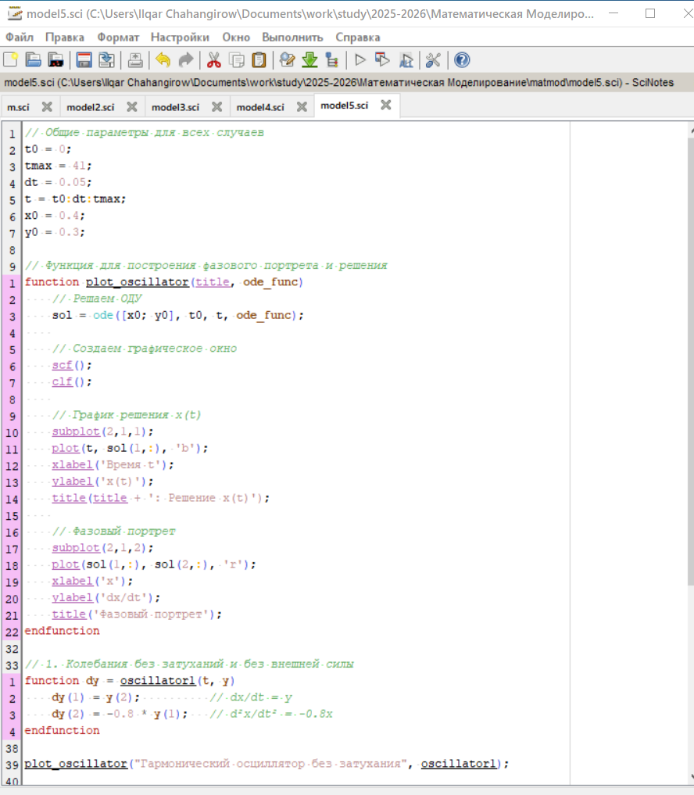
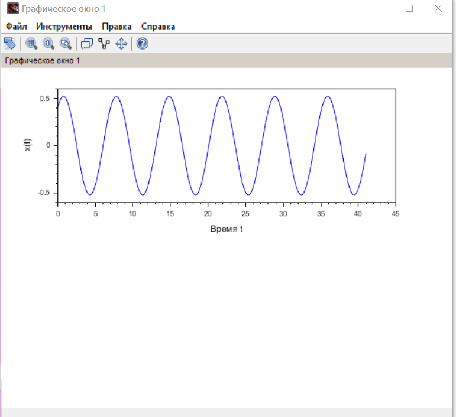

---
## Front matter
lang: ru-RU
title: Лабораторная работа №4
subtitle: Модель гармонических колебаний
author:
  - Джахангиров Илгар Залид оглы
institute:
  - Российский университет дружбы народов, Москва, Россия

## i18n babel
babel-lang: russian
babel-otherlangs: english

## Formatting pdf
toc: false
toc-title: Содержание
slide_level: 2
aspectratio: 169
section-titles: true
theme: metropolis
header-includes:
 - \metroset{progressbar=frametitle,sectionpage=progressbar,numbering=fraction}
 - '\makeatletter'
 - '\beamer@ignorenonframefalse'
 - '\makeatother'
---

# Информация

## Докладчик

:::::::::::::: {.columns align=center}
::: {.column width="70%"}

  * Джахангиров Илгар Залид оглы
  * студент
  * Российский университет дружбы народов
  * [1032225689@pfur.ru]

:::
::::::::::::::

## Цель работы

Построить математическую модель гармонического осциллятора.

# Задание

Построить фазовый портрет гармонического осциллятора и решение уравнения
гармонического осциллятора для следующих случаев:

Постройте фазовый портрет гармонического осциллятора и решение уравнения
гармонического осциллятора для следующих случаев
1. Колебания гармонического осциллятора без затуханий и без действий внешней
силы
x x   0.8 0
2. Колебания гармонического осциллятора c затуханием и без действий внешней
силы
x x x    0.8 0.4 0
3. Колебания гармонического осциллятора c затуханием и под действием внешней
силы
x x x t    5 cos 5 
На интервале
t 0; 41
(шаг 0.05) с начальными условиями
0 0 x y   0.4, 0.3

#выполнения лабараторной работы

# Выводы

В процессе выполнения данной лабораторной работы я построил математическую модель гармонического осциллятора.

# Список литературы{.unnumbered}

::: {#refs}
:::