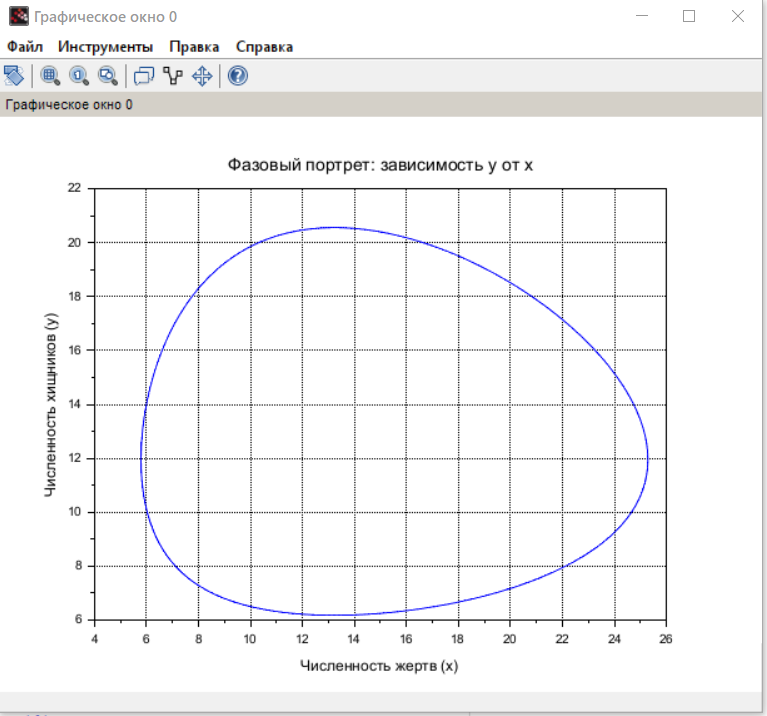
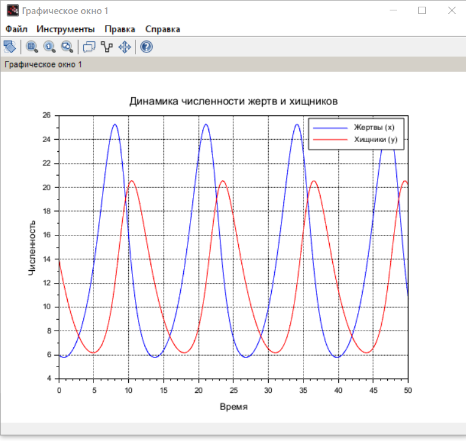
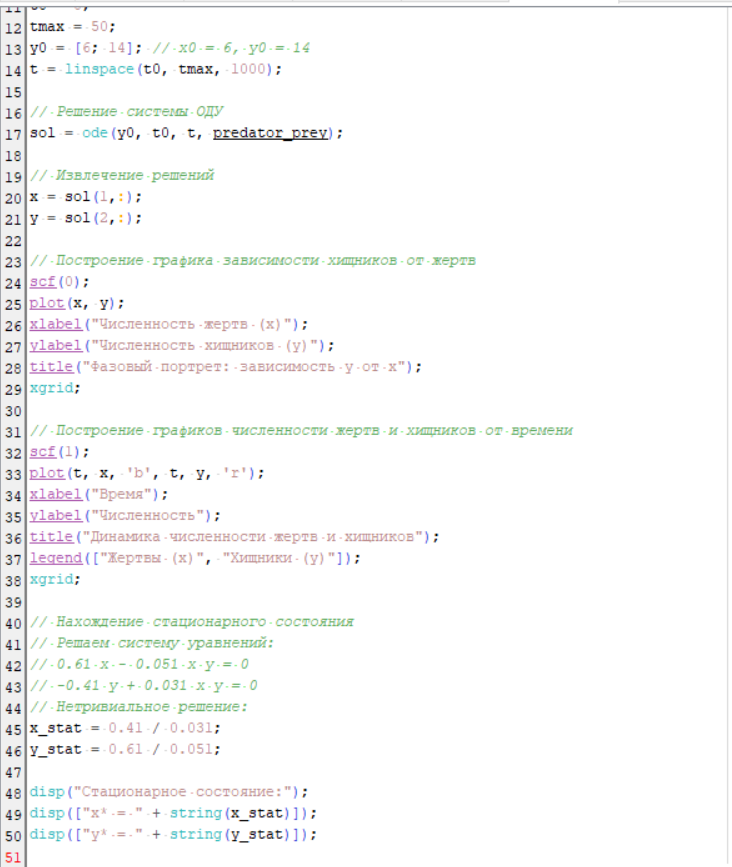

---
## Front matter
lang: ru-RU
title: Лабораторная работа №5
subtitle: Модель Лотки-Вольтерры
author:
  - Джахангиров Илгар Залид оглы
institute:
  - Российский университет дружбы народов, Москва, Россия

## i18n babel
babel-lang: russian
babel-otherlangs: english

## Formatting pdf
toc: false
toc-title: Содержание
slide_level: 2
aspectratio: 169
section-titles: true
theme: metropolis
header-includes:
 - \metroset{progressbar=frametitle,sectionpage=progressbar,numbering=fraction}
 - '\makeatletter'
 - '\beamer@ignorenonframefalse'
 - '\makeatother'
---

# Информация

## Докладчик

:::::::::::::: {.columns align=center}
::: {.column width="70%"}

  * Джахангиров Илгар Залид оглы
  * студент
  * Российский университет дружбы народов
  * [1032225689@pfur.ru]

:::
::::::::::::::

##  Цель работы

Исследовать математическую модель Лотки-Вольерры.

## Задание

## выполнения лабараторной работы 

Для модели «хищник-жертва»:

## выполнения лабараторной работы 

## выполнения лабараторной работы 

## выполнения лабараторной работы 

## Сравнение построения модели на Julia и в OpenModelica

Полученные графики идентичны. Никаких особых различий не видно.

## Выводы

В результате выполнения лабораторной работы я построил математическую модель Лотки-Вольтерры на Julia и в OpenModelica.

# Список литературы{.unnumbered}

::: {#refs}
:::
