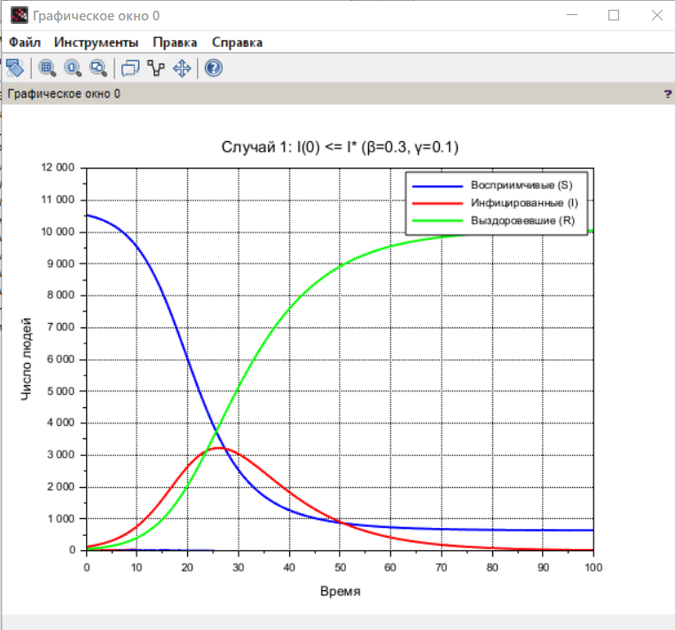
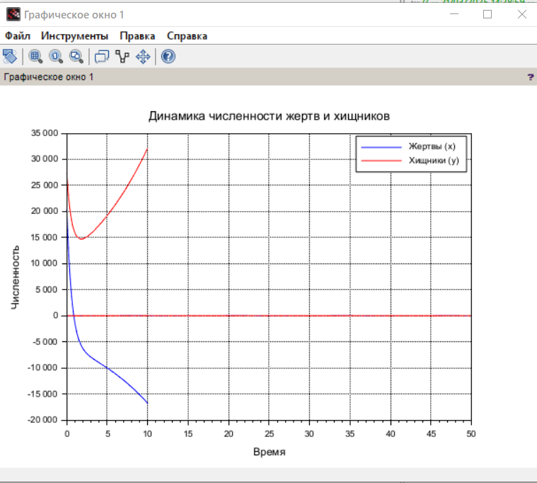
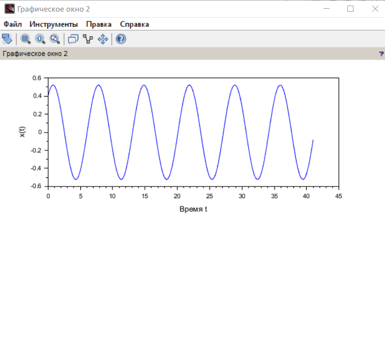
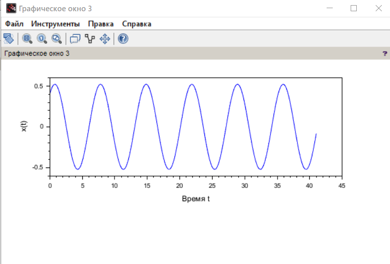

---
## Front matter
lang: ru-RU
title: Лабораторная работа №6
subtitle: Задача об эпидемии
author:
  - Джахангиров Илгар Залид оглы
institute:
  - Российский университет дружбы народов, Москва, Россия

## i18n babel
babel-lang: russian
babel-otherlangs: english

## Formatting pdf
toc: false
toc-title: Содержание
slide_level: 2
aspectratio: 169
section-titles: true
theme: metropolis
header-includes:
 - \metroset{progressbar=frametitle,sectionpage=progressbar,numbering=fraction}
 - '\makeatletter'
 - '\beamer@ignorenonframefalse'
 - '\makeatother'
---

# Информация

## Докладчик

:::::::::::::: {.columns align=center}
::: {.column width="70%"}

  * Джахангиров Илгар Залид оглы
  * студент
  * Российский университет дружбы народов
  * [1032225689@pfur.ru]

:::
::::::::::::::

## Цель работы

Исследовать модель SIR (задача об эпидемии)

# Задание

На одном острове вспыхнула эпидемия. Известно, что из всех проживающих
на острове (N=10 700) в момент начала эпидемии (t=0) число заболевших людей
(являющихся распространителями инфекции) I(0)=121, А число здоровых людей с
иммунитетом к болезни R(0)=50. Таким образом, число людей восприимчивых к
болезни, но пока здоровых, в начальный момент времени S(0)=N-I(0)- R(0).
Постройте графики изменения числа особей в каждой из трех групп.
Рассмотрите, как будет протекать эпидемия в случае:
1) если
 
*
I 0  I
2) если
 
*
I 0  I

# Выполнение лабораторной работы

// Параметры модели
N = 10700;
I0 = 121;
R0 = 50;
S0 = N - I0 - R0;

// Случай 1: I(0) <= I* (эпидемия затухает)
beta1 = 0.3;
gamma1 = 0.1;
I_star1 = (gamma1 / beta1) * (N - R0);

// Случай 2: I(0) > I* (эпидемия развивается)
beta2 = 0.3;
gamma2 = 0.05;
I_star2 = (gamma2 / beta2) * (N - R0);

// Функция системы дифференциальных уравнений SIR
function dydt = sirModel(t, y, beta, gamma, N)
    S = y(1);
    I = y(2);
    R = y(3);
    dSdt = -beta * S * I / N;
    dIdt = beta * S * I / N - gamma * I;
    dRdt = gamma * I;
    dydt = [dSdt; dIdt; dRdt];
endfunction

// Временной интервал
t = 0:0.1:100;

// Решение для случая 1 (I0 <= I*)
if I0 <= I_star1 then
    y0 = [S0; I0; R0];
    y1 = ode(y0, 0, t, list(sirModel, beta1, gamma1, N));
    S1 = y1(1,:);
    I1 = y1(2,:);
    R1 = y1(3,:);
else
    disp("Для случая 1 I(0) > I*, эпидемия разовьётся.");
end

// Решение для случая 2 (I0 > I*)
if I0 > I_star2 then
    y0 = [S0; I0; R0];
    y2 = ode(y0, 0, t, list(sirModel, beta2, gamma2, N));
    S2 = y2(1,:);
    I2 = y2(2,:);
    R2 = y2(3,:);
else
    disp("Для случая 2 I(0) <= I*, эпидемия не разовьётся.");
end

// Построение графиков
scf(0);
if exists('S1') == 1 then
    plot(t, S1, 'b', 'LineWidth', 2);
    plot(t, I1, 'r', 'LineWidth', 2);
    plot(t, R1, 'g', 'LineWidth', 2);
    xlabel("Время");
    ylabel("Число людей");
    title("Случай 1: I(0) <= I* (β=" + string(beta1) + ", γ=" + string(gamma1) + ")");
    legend(["Восприимчивые (S)", "Инфицированные (I)", "Выздоровевшие (R)"]);
else
    disp("Нет данных для случая 1.");
end

scf(1);
if exists('S2') == 1 then
    plot(t, S2, 'b', 'LineWidth', 2);
    plot(t, I2, 'r', 'LineWidth', 2);
    plot(t, R2, 'g', 'LineWidth', 2);
    xlabel("Время");
    ylabel("Число людей");
    title("Случай 2: I(0) > I* (β=" + string(beta2) + ", γ=" + string(gamma2) + ")");
    legend(["Восприимчивые (S)", "Инфицированные (I)", "Выздоровевшие (R)"]);
else
    disp("Нет данных для случая 2.");
end

# Выполнение лабораторной работы

В результате выполнения данной лабораторной работы я исследовал модель SIR.

# Список литературы{.unnumbered}

::: {#refs}
:::
