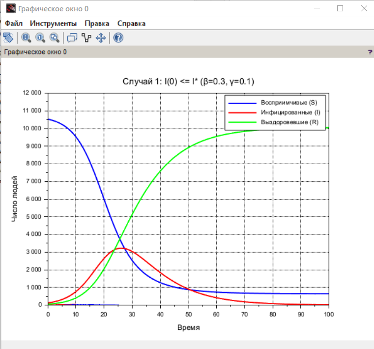
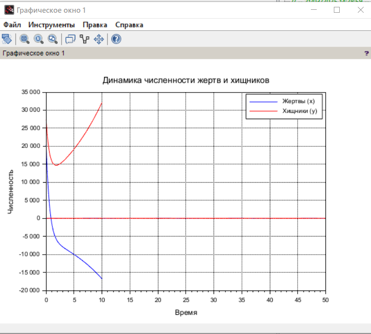
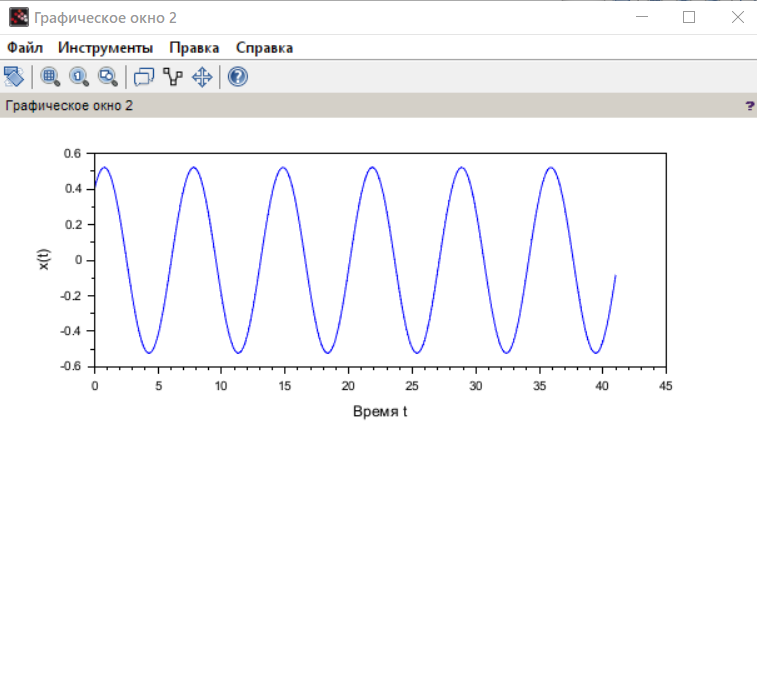
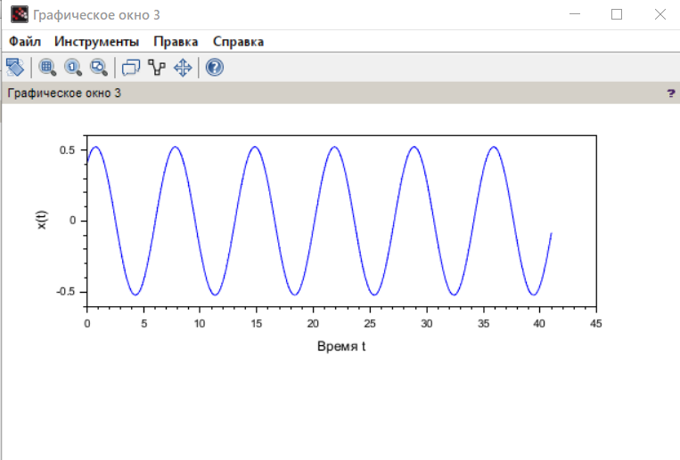

---
## Front matter
title: "Лабораторная работа № 6"
subtitle: "Задача об эпидемии"
author: "Джахангиров Илгар Залид оглы"

## Generic otions
lang: ru-RU
toc-title: "Содержание"

## Bibliography
bibliography: bib/cite.bib
csl: pandoc/csl/gost-r-7-0-5-2008-numeric.csl

## Pdf output format
toc: true # Table of contents
toc-depth: 2
lof: true # List of figures
lot: false # List of tables
fontsize: 12pt
linestretch: 1.5
papersize: a4
documentclass: scrreprt
## I18n polyglossia
polyglossia-lang:
  name: russian
  options:
	- spelling=modern
	- babelshorthands=true
polyglossia-otherlangs:
  name: english
## I18n babel
babel-lang: russian
babel-otherlangs: english
## Fonts
mainfont: PT Serif
romanfont: PT Serif
sansfont: PT Sans
monofont: PT Mono
mainfontoptions: Ligatures=TeX
romanfontoptions: Ligatures=TeX
sansfontoptions: Ligatures=TeX,Scale=MatchLowercase
monofontoptions: Scale=MatchLowercase,Scale=0.9
## Biblatex
biblatex: true
biblio-style: "gost-numeric"
biblatexoptions:
  - parentracker=true
  - backend=biber
  - hyperref=auto
  - language=auto
  - autolang=other*
  - citestyle=gost-numeric
## Pandoc-crossref LaTeX customization
figureTitle: "Рис."
tableTitle: "Таблица"
listingTitle: "Листинг"
lofTitle: "Список иллюстраций"
lotTitle: "Список таблиц"
lolTitle: "Листинги"
## Misc options
indent: true
header-includes:
  - \usepackage{indentfirst}
  - \usepackage{float} # keep figures where there are in the text
  - \floatplacement{figure}{H} # keep figures where there are in the text
---

# Цель работы

Исследовать модель SIR (задача об эпидемии)

# Задание

На одном острове вспыхнула эпидемия. Известно, что из всех проживающих
на острове (N=10 700) в момент начала эпидемии (t=0) число заболевших людей
(являющихся распространителями инфекции) I(0)=121, А число здоровых людей с
иммунитетом к болезни R(0)=50. Таким образом, число людей восприимчивых к
болезни, но пока здоровых, в начальный момент времени S(0)=N-I(0)- R(0).
Постройте графики изменения числа особей в каждой из трех групп.
Рассмотрите, как будет протекать эпидемия в случае:
1) если
 
*
I 0  I
2) если
 
*
I 0  I

# Выполнение лабораторной работы

// Параметры модели
N = 10700;
I0 = 121;
R0 = 50;
S0 = N - I0 - R0;

// Случай 1: I(0) <= I* (эпидемия затухает)
beta1 = 0.3;
gamma1 = 0.1;
I_star1 = (gamma1 / beta1) * (N - R0);

// Случай 2: I(0) > I* (эпидемия развивается)
beta2 = 0.3;
gamma2 = 0.05;
I_star2 = (gamma2 / beta2) * (N - R0);

// Функция системы дифференциальных уравнений SIR
function dydt = sirModel(t, y, beta, gamma, N)
    S = y(1);
    I = y(2);
    R = y(3);
    dSdt = -beta * S * I / N;
    dIdt = beta * S * I / N - gamma * I;
    dRdt = gamma * I;
    dydt = [dSdt; dIdt; dRdt];
endfunction

// Временной интервал
t = 0:0.1:100;

// Решение для случая 1 (I0 <= I*)
if I0 <= I_star1 then
    y0 = [S0; I0; R0];
    y1 = ode(y0, 0, t, list(sirModel, beta1, gamma1, N));
    S1 = y1(1,:);
    I1 = y1(2,:);
    R1 = y1(3,:);
else
    disp("Для случая 1 I(0) > I*, эпидемия разовьётся.");
end

// Решение для случая 2 (I0 > I*)
if I0 > I_star2 then
    y0 = [S0; I0; R0];
    y2 = ode(y0, 0, t, list(sirModel, beta2, gamma2, N));
    S2 = y2(1,:);
    I2 = y2(2,:);
    R2 = y2(3,:);
else
    disp("Для случая 2 I(0) <= I*, эпидемия не разовьётся.");
end

// Построение графиков
scf(0);
if exists('S1') == 1 then
    plot(t, S1, 'b', 'LineWidth', 2);
    plot(t, I1, 'r', 'LineWidth', 2);
    plot(t, R1, 'g', 'LineWidth', 2);
    xlabel("Время");
    ylabel("Число людей");
    title("Случай 1: I(0) <= I* (β=" + string(beta1) + ", γ=" + string(gamma1) + ")");
    legend(["Восприимчивые (S)", "Инфицированные (I)", "Выздоровевшие (R)"]);
else
    disp("Нет данных для случая 1.");
end

scf(1);
if exists('S2') == 1 then
    plot(t, S2, 'b', 'LineWidth', 2);
    plot(t, I2, 'r', 'LineWidth', 2);
    plot(t, R2, 'g', 'LineWidth', 2);
    xlabel("Время");
    ylabel("Число людей");
    title("Случай 2: I(0) > I* (β=" + string(beta2) + ", γ=" + string(gamma2) + ")");
    legend(["Восприимчивые (S)", "Инфицированные (I)", "Выздоровевшие (R)"]);
else
    disp("Нет данных для случая 2.");
end

# Выполнение лабораторной работы

В результате выполнения данной лабораторной работы я исследовал модель SIR.

# Список литературы{.unnumbered}

::: {#refs}
:::
