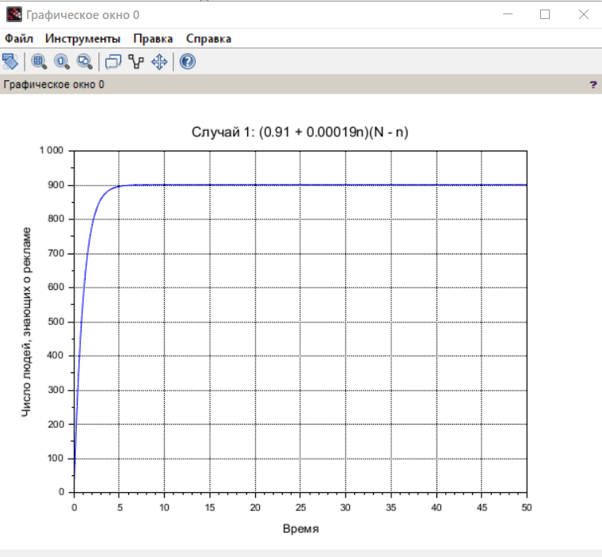
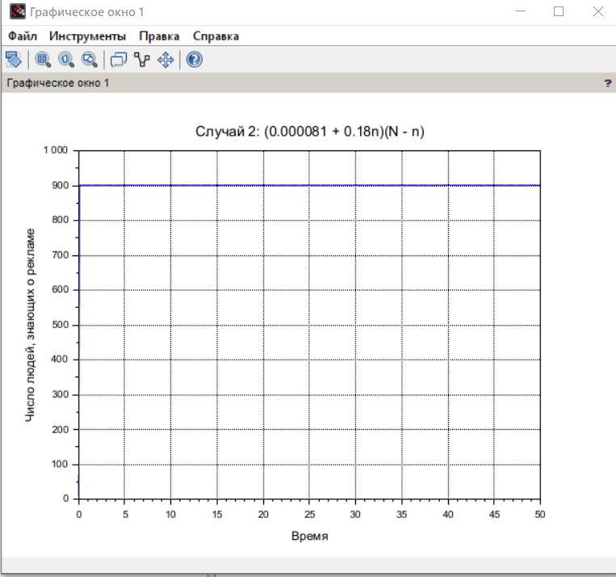
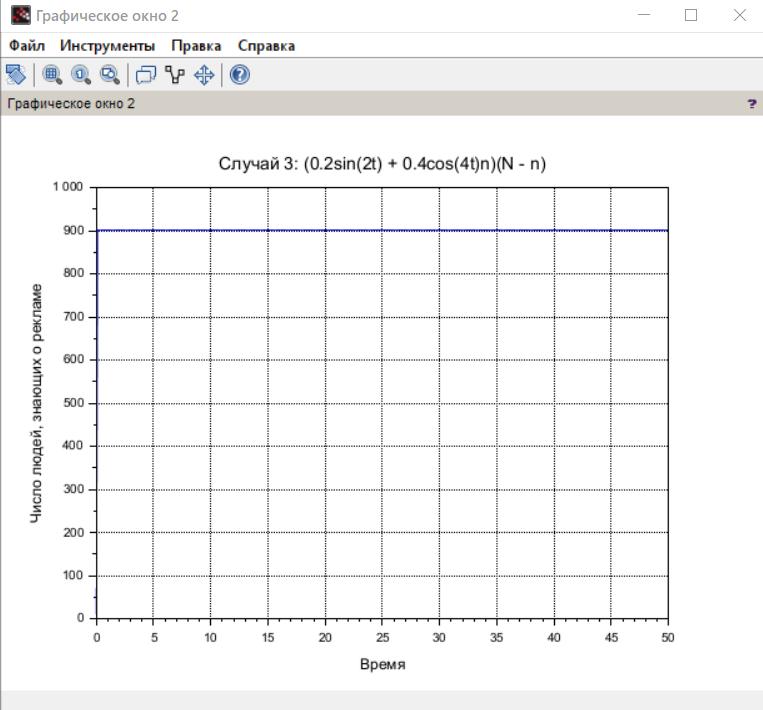
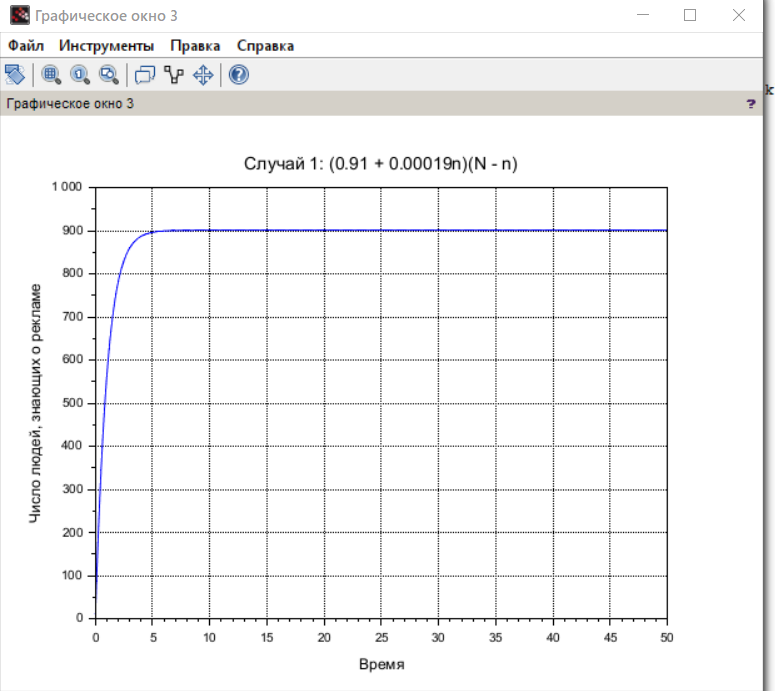
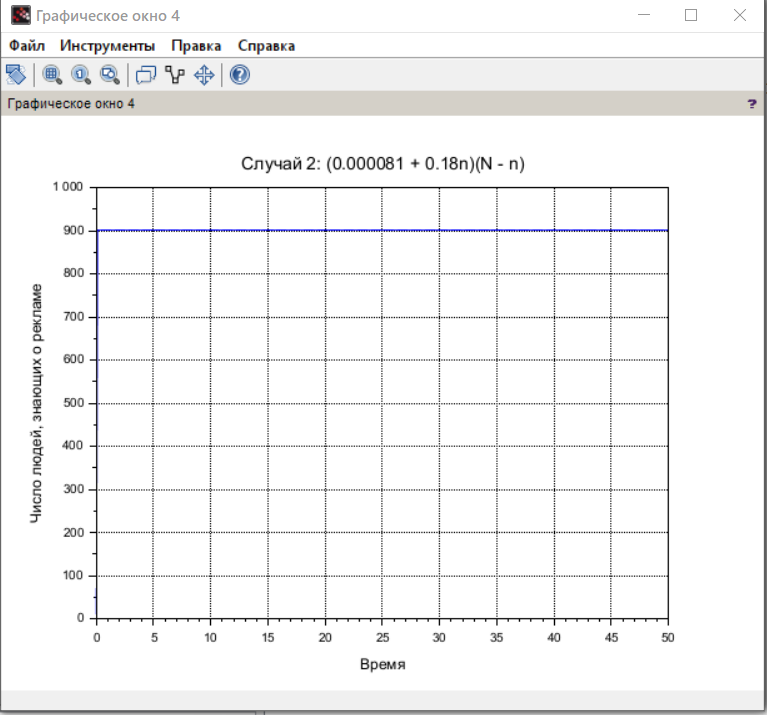
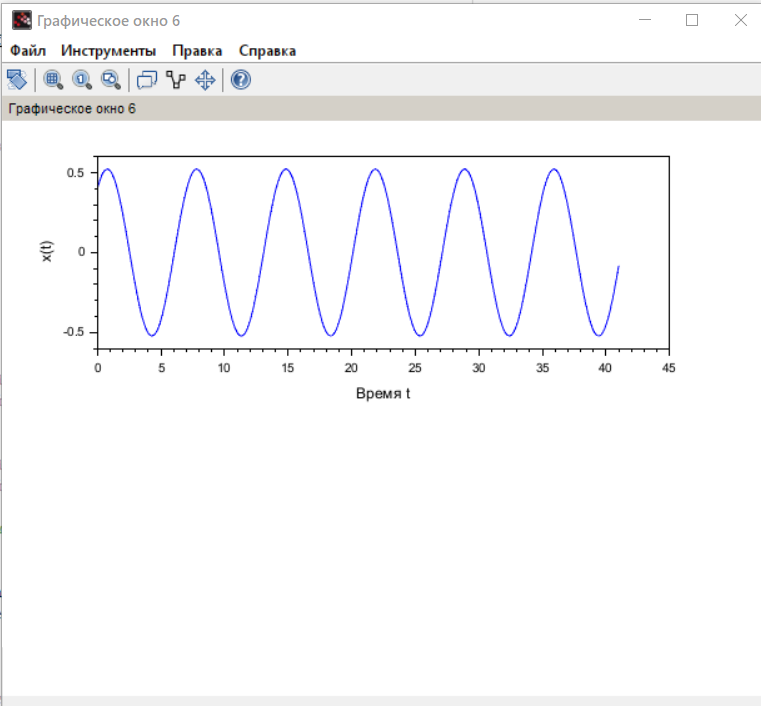

---
## Front matter
lang: ru-RU
title: Лабораторная работа №7
subtitle: Эффективность рекламы
author:
  - Джахангиров Илгар Залид оглы
institute:
  - Российский университет дружбы народов, Москва, Россия

## i18n babel
babel-lang: russian
babel-otherlangs: english

## Formatting pdf
toc: false
toc-title: Содержание
slide_level: 2
aspectratio: 169
section-titles: true
theme: metropolis
header-includes:
 - \metroset{progressbar=frametitle,sectionpage=progressbar,numbering=fraction}
 - '\makeatletter'
 - '\beamer@ignorenonframefalse'
 - '\makeatother'
---

# Информация

## Докладчик

:::::::::::::: {.columns align=center}
::: {.column width="70%"}

  * Джахангиров Илгар Залид оглы
  * студент
  * Российский университет дружбы народов
  * [1032225689@pfur.ru]

:::
::::::::::::::

## Цель работы

Исследовать модель эффективности рекламы.

## Задание

Постройте график распространения рекламы, математическая модель которой описывается
следующим уравнением:
1.
0.91 0.00019    
dn n t N n t
dt
  
2.
0.000081 0.18    
dn n t N n t
dt
  
3.
0.2sin 2 0.4cos 4        
dn t t n t N n t
dt
  
При этом объем аудитории
N  901
, в начальный момент о товаре знает 9 человек. Для
случая 2 определите в какой момент времени скорость распространения рекламы будет
иметь максимальное значение.

## Выполнение лабораторной работы 

## Выполнение лабораторной работы 

## Выполнение лабораторной работы 

## Выполнение лабораторной работы 

## Выполнение лабораторной работы 

## Выполнение лабораторной работы 

## Выполнение лабораторной работы 

## вывод

В результате выполнения данной лабораторной работы была исследована модель эффективности рекламы.