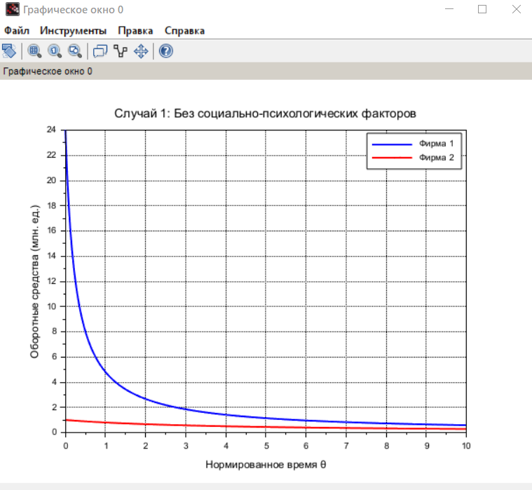
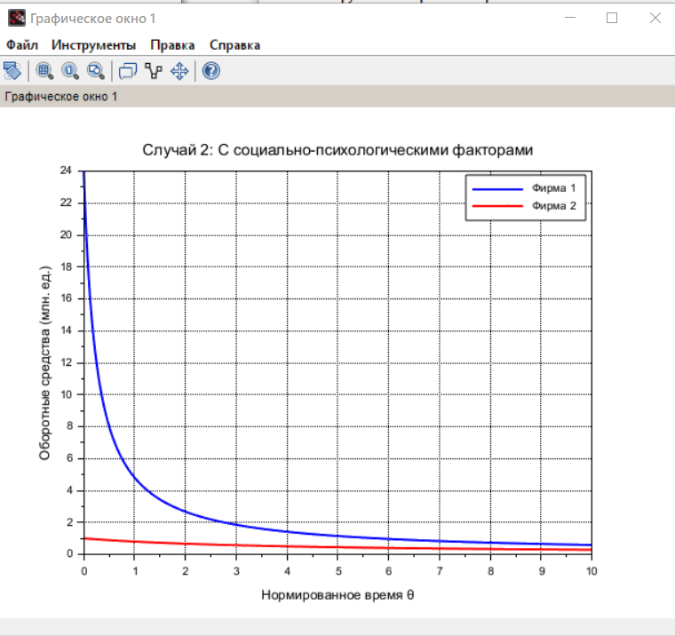
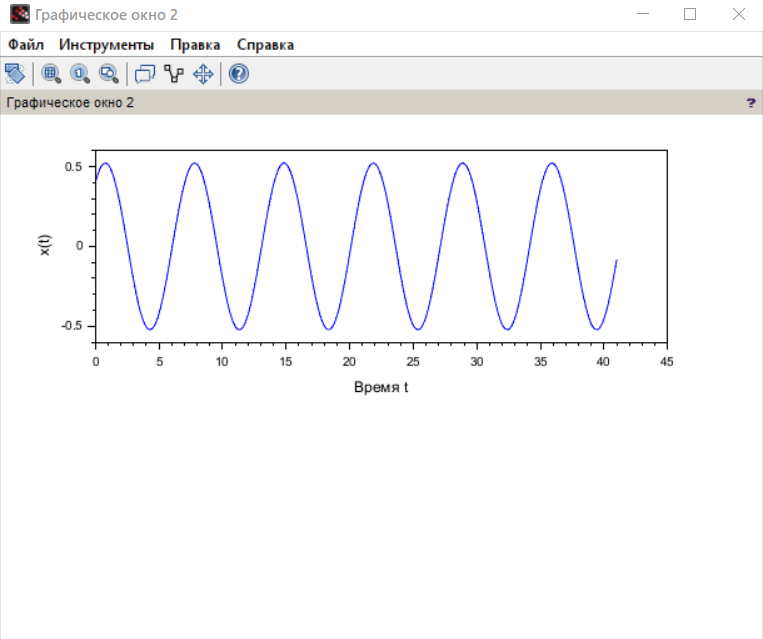
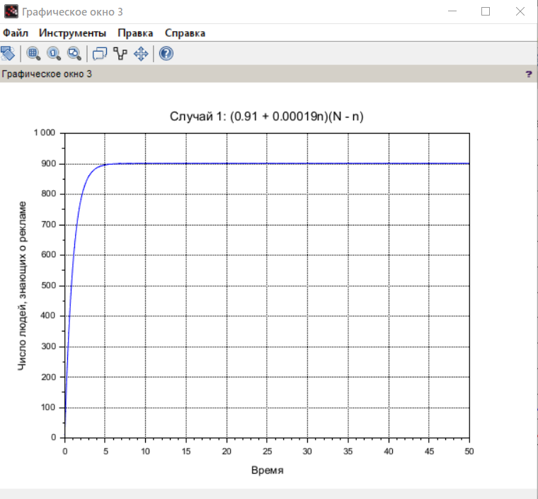
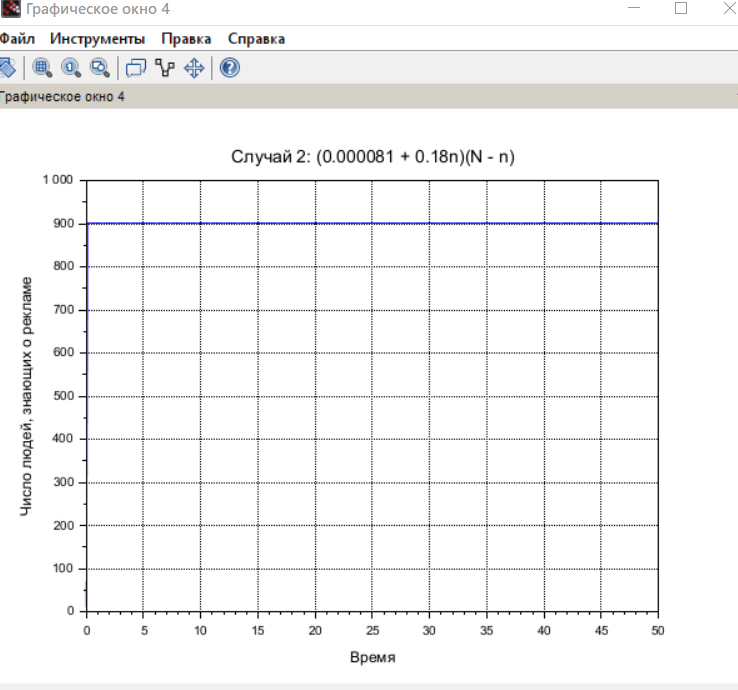
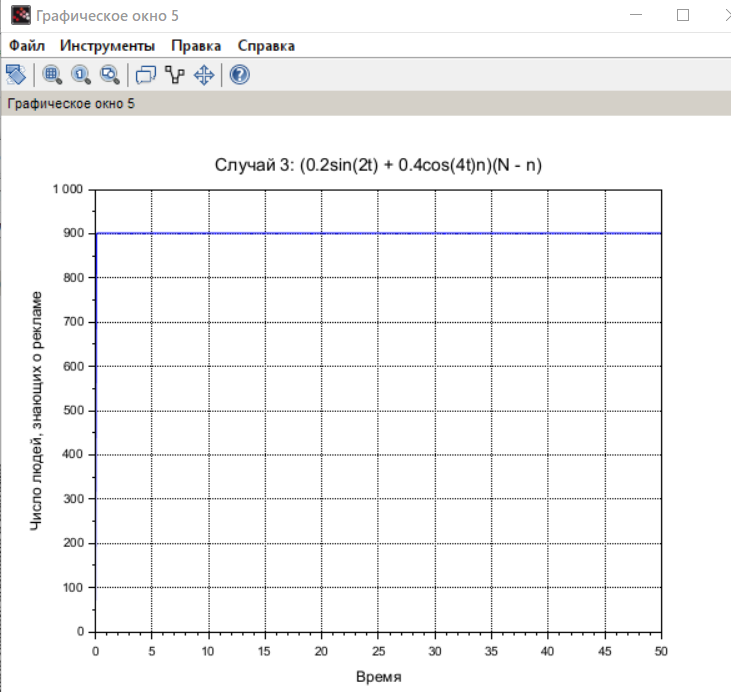

---
## Front matter
title: "Лабораторная работа № 8"
subtitle: "Модель конкуренции двух фирм"
author: "Джахангиров Илгар Залид оглы"

## Generic otions
lang: ru-RU
toc-title: "Содержание"

## Bibliography
bibliography: bib/cite.bib
csl: pandoc/csl/gost-r-7-0-5-2008-numeric.csl

## Pdf output format
toc: true # Table of contents
toc-depth: 2
lof: true # List of figures
lot: false # List of tables
fontsize: 12pt
linestretch: 1.5
papersize: a4
documentclass: scrreprt
## I18n polyglossia
polyglossia-lang:
  name: russian
  options:
	- spelling=modern
	- babelshorthands=true
polyglossia-otherlangs:
  name: english
## I18n babel
babel-lang: russian
babel-otherlangs: english
## Fonts
mainfont: PT Serif
romanfont: PT Serif
sansfont: PT Sans
monofont: PT Mono
mainfontoptions: Ligatures=TeX
romanfontoptions: Ligatures=TeX
sansfontoptions: Ligatures=TeX,Scale=MatchLowercase
monofontoptions: Scale=MatchLowercase,Scale=0.9
## Biblatex
biblatex: true
biblio-style: "gost-numeric"
biblatexoptions:
  - parentracker=true
  - backend=biber
  - hyperref=auto
  - language=auto
  - autolang=other*
  - citestyle=gost-numeric
## Pandoc-crossref LaTeX customization
figureTitle: "Рис."
tableTitle: "Таблица"
listingTitle: "Листинг"
lofTitle: "Список иллюстраций"
lotTitle: "Список таблиц"
lolTitle: "Листинги"
## Misc options
indent: true
header-includes:
  - \usepackage{indentfirst}
  - \usepackage{float} # keep figures where there are in the text
  - \floatplacement{figure}{H} # keep figures where there are in the text
---

# Цель работы

Исследовать математическую модель конкуренции двух фирм.

# Задание

Случай 1. Рассмотрим две фирмы, производящие взаимозаменяемые товары
одинакового качества и находящиеся в одной рыночной нише. Считаем, что в рамках
нашей модели конкурентная борьба ведётся только рыночными методами. То есть,
конкуренты могут влиять на противника путем изменения параметров своего
производства: себестоимость, время цикла, но не могут прямо вмешиваться в
ситуацию на рынке («назначать» цену или влиять на потребителей каким-либо иным
способом.) Будем считать, что постоянные издержки пренебрежимо малы, и в
модели учитывать не будем. В этом случае динамика изменения объемов продаж
фирмы 1 и фирмы 2 описывается следующей системой уравнений:
1 1 2
1 1 2 1
1 1
2 2 2 2
2 1 2 2
1 1 1
dM b a M M M M
d c c
dM c b a M M M M
d c c c


  
  
,
где
1 2
1 2 1 2 2 2 2 2 2 2 2 2
1 1 2 2 1 1 2 2 1 1 2 2
, , , ,
cr cr cr cr cr
p p p p p p p a a b c c
      p Nq p Nq p p Nq p p
 
     .
Также введена нормировка
1
t c   .
Случай 2. Рассмотрим модель, когда, помимо экономического фактора
влияния (изменение себестоимости, производственного цикла, использование
кредита и т.п.), используются еще и социально-психологические факторы –
формирование общественного предпочтения одного товара другому, не зависимо от
их качества и цены. В этом случае взаимодействие двух фирм будет зависеть друг
от друга, соответственно коэффициент перед
M M1 2
будет отличаться. Пусть в
рамках рассматриваемой модели динамика изменения объемов продаж фирмы 1 и
фирмы 2 описывается следующей системой уравнений:
1 1 2
1 1 2 1
1 1
2 2 2 2
2 1 2 2
1 1 1
0,0012 dM b a M M M M
d c c
dM c b a M M M M
d c c c


 
       
  
Для обоих случаев рассмотрим задачу со следующими начальными условиями и
параметрами:
1 2
0 0
1 2
1 2
3.9, 3,
9.9, 24, 1
12, 18,
6, 4
cr
M M
p N q
p p
 
 
  
 
 
Замечание: Значения
1,2 , ,
cr
p p N
указаны в тысячах единиц, а значения
M1,2

указаны в млн. единиц.
Обозначения:
N – число потребителей производимого продукта.
τ – длительность производственного цикла
p – рыночная цена товара
p̃– себестоимость продукта, то есть переменные издержки на производство единицы
продукции.
q – максимальная потребность одного человека в продукте в единицу времени
1
t
c
  - безразмерное время
1. Постройте графики изменения оборотных средств фирмы 1 и фирмы 2 без
учета постоянных издержек и с веденной нормировкой для случая 1.
2. Постройте графики изменения оборотных средств фирмы 1 и фирмы 2 без
учета постоянных издержек и с веденной нормировкой для случая 2

# Выполнение лабораторной работы 

# вывод

В результате выполнения лабораторной работы была исследована модель конкуренции двух фирм.
